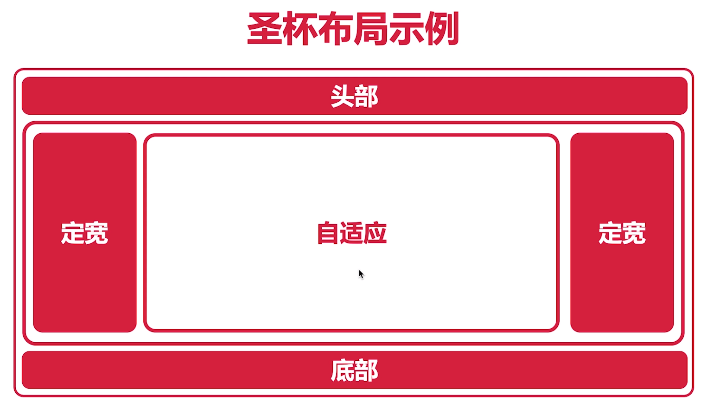

# 布局

## 什么是布局

- 简单来说就是 HTML 页面的整体结构或骨架，类似于传统的保值或杂志中的排版
- 布局不是某个技术内容，而是一种设计思想

## 什么是居中布局

## 居中布局的分类

- 水平居中布局
- 垂直居中布局
- 居中布局（水平+垂直）

## 什么水平居中布局

- 水平居中布局就是指当前元素父级元素容器中，水平方向是居中显示的

## 水平居中布局实现方式

- inline-block + text-align 属性配合使用
- table + margin 属性配合使用
- absolute + transform 属性配合使用

第一种方案

第一种解决方案优缺点

- 优点：浏览器兼容性比较好
- 缺点：text-align 属性具有继承性，导致子级元素的文本也是居中显示的

第二种方案

```html
<div class="parent">
  <div class="child">
    child
  </div>
</div>
```

```css
.child {
  display: table;
  margin: 0 auto;
}
```

第三种解决方案优缺点

- 优点：只需要对子级元素进行设置就可以实现水平方式居中布局效果
- 缺点：如果子级元素脱离文档流，导致 margin 属性的值无效

第三种方案

```html
<div class="parent">
  <div class="child">
    child
  </div>
</div>
```

```css
.parent {
  position: relative;
}
.child {
  position: absolute;
  left: 50%;
  transform: translateX(-50%);
}
```

第二种解决方案优缺点

- 优点：父级元素是否脱离文档流，不影响子级元素水平居中效果
- 缺点：transform属性是CSS3中新增属性，浏览器支持情况不好

## 什么是垂直居中布局

## 垂直居中布局实现方式

- table-cell + vertical-align 属性配合使用
- absolute + transform 属性配合使用

第一种方案

```html
<div class="parent">
  <div class="child">
    child
  </div>
</div>
```

```css
.parent {
  display: table-cell;
  vertical-align: middle;
}
```

第一种解决方案优缺点

- 优点：浏览器兼容性比较好
- 缺点：vertical-align属性具有继承性，导致父级元素的文本也是居中显示的

第二种方案

```html
<div class="parent">
  <div class="child">
    child
  </div>
</div>
```

```css
.parent {
  position: relative;
}
.child {
  position: absolute;
  top: 50%;
  transform: translateY(-50%);
}
```

第二种解决方案优缺点

- 优点：父级元素是否脱离文档流，不影响子级元素垂直居中效果
- 缺点：transform属性是CSS3中新增属性，浏览器支持情况不好

## 居中布局（水平+垂直）

- table + margin 实现水平方向居中，table-cell + vertical-align实现垂直方向居中
- absolute + transform 实现水平方向和垂直方向居中

第一种方案

```html
<div class="parent">
  <div class="child">
    child
  </div>
</div>
```

```css
.parent {
  display: table-cell;
  vertical-align: middle;
}
```

第一种解决方案优缺点

- 优点：浏览器兼容性比较好
- 缺点：vertical-align属性具有继承性，导致父级元素的文本也是居中显示的

第二种方案

```html
<div class="parent">
  <div class="child">
    child
  </div>
</div>
```

```css
.parent {
  position: relative;
}
.child {
  position: absolute;
  left: 50%;
  top: 50%;
  transform: translate(-50%, -50%);
}
```

第二种解决方案优缺点

- 优点：父级元素是否脱离文档流，不影响子级元素垂直居中效果
- 缺点：transform属性是CSS3中新增属性，浏览器支持情况不好

## 多列布局

简单来说，所谓多列布局就是几个元素呈现水平方式排列的效果

多列布局的分类

- 两列布局
- 三列布局
- 圣杯布局与双飞翼布局
- 等分布局
- 等高布局
- CSS3 多列布局

### 两列布局

两列布局一般情况下是制定宽与自适应布局，两列中左列是确定的宽度，右列是自动填满剩余所有空间的一种布局效果。

两列布局实现方式

- float + margin 属性配合使用
- float + overflow 属性配合使用
- display 属性的 table 相关值使用

第一种方案

```html
<div class="parent">
  <div class="left">左：定宽</div>
  <div class="right">右：自适应</div>
</div>
```

```css
.left {
  width: 100px;
  float: left;
}
.right {
  margin-left: 100px;
}
```

第一种解决方案优缺点

- 优点：实现方式简单
- 缺点：
  - 自适应元素 margin 属性值与定宽元素的 width 属性值保持一致
  - 定宽元素浮动与自适应元素不浮动导致浏览器兼容性不好
  - .right元素的子元素设置clear:both也会影响到.left浮动元素

第一种方案优化版

```html
<div class="parent">
  <div class="left">左：定宽</div>
  <div class="right-fix">
  	<div class="right">右：自适应</div>
  </div>
</div>
```

```css
.left {
  position: relative;
}
.right {
  float: right;
  width: 100%;
  margin-left: -100px;
}
```

第一种解决方案优化版优缺点

- 优点：实现方式简单
- 缺点：
  - 自适应元素 margin 属性值与定宽元素的 width 属性值保持一致
  - 定宽元素浮动与自适应元素不浮动导致浏览器兼容性不好

第二种方案

```html
<div class="parent">
  <div class="left">左：定宽</div>
  <div class="right">右：自适应</div>
</div>
```

```css
.left {
  width: 100px;
  float: left;
}
.right {
  overflow: hidden;
}
```

第二种解决方案

- 优点：上述解决方案中的问题在此解决方案中都没有
- 缺点：overflow属性不仅解决了两列布局问题，同事设置了内容溢出的情况

第三种方案

```html
<div class="parent">
  <div class="left">左：定宽</div>
  <div class="right">右：自适应</div>
</div>
```

```css
.parent {
  display: table;
  table-layout: fixed;
}
.left, .right {
  display: table-cell;
}
.left {
  width: 100px;
}
```

第三种解决方案

- 优点：浏览器兼容性比较好
- 缺点：将所有元素的 display 属性设置为 table 相关值，收到相应制约

### 三列布局

三列布局一般情况下是指三列中左边两列是确定的宽度，右边一列是自动填满剩余所有空间的一种布局效果

三列布局实现方式

- float + margin 属性配合使用
- float + overflow 属性配合使用
- display 属性的 table 相关值使用

#### 圣杯布局

圣杯布局是来源于布局效果类似于圣杯而得名。简单来说，就是指三行三列布局

圣杯布局主要是实现中间主题部分中的左右定宽+中间自适应的布局效果



## 双飞翼布局

双飞翼布局最早是淘宝团队提出，是针对圣杯局部的优化解决方案。主要是优化了圣杯布局中开启定位的问题

## 等分布局

等分布局就是指一行被分为若干列，每一列的宽度是相同的值

等分布局实现方式

- float 属性实现等分布局效果
- display 属性的值有关 table 实现等分布局效果

第一种方案

```html
<div class="parent">
    <div class="column"><p>1</p></div>
    <div class="column"><p>2</p></div>
    <div class="column"><p>3</p></div>
    <div class="column"><p>4</p></div>
  </div>
```

```css
.column {
  float: left;
  width: 25%;
  box-sizing: border-box;
}
```

第二种方案

```html
<div class="parent">
    <div class="column"><p>1</p></div>
    <div class="column"><p>2</p></div>
    <div class="column"><p>3</p></div>
    <div class="column"><p>4</p></div>
  </div>
```

```css
.parent {
  display: table;
  table-layout: fixed;
}
.column {
  display: table-cell;
}
```

等分布局存在间距的情况

实现等分布局时，如果需要每一列之间时间空白间隔区域的话

公式：间距+容器宽度=(间距+列宽度) * N


HTML 代码的变化

在原有 HTML页面源代码的基础上，添加一个容器元素

```html
<div class="parent-fix">
    <div class="parent">
      <div class="col1"></div>
      <div class="col2"></div>
      <div class="col3"></div>
      <div class="col4"></div>
    </div>
  </div>
```

## 等高布局

等高布局就是一行被划分成若干列，每一列的高度是相同的值

等高布局实现方式

- display 属性的值有关 table 实现等高布局效果
- padding + margin 属性实现等高布局效果

第一种方案

```html
<div class="parent">
    <div class="left"></div>
    <div class="right"></div>
  </div>
```

```css
.parent {
  display: table;
  table-layout: fixed;
}
.left, .right {
  display: table-cell;
}
.left {
  width: 100px;
}
```

第二种方案

第二种解决方案实现的不是真正的等高布局，知识视觉上等高的伪等高布局

```html
<div class="parent">
    <div class="left"></div>
    <div class="right"></div>
  </div>
```

```css
.parent {
  overflow: hidden;
}
.left, .right {
  padding-bottom: 9999px;
  margin-bottom: -9999px;
}
.left {
  width: 100px;
  float: left;
}
.right {
  overflow: hidden;
}
```

## CSS3多列布局

columns属性

- columns属性是一个简写属性
  - column-count属性：定义列的数量，用于设置列的数量或者允许的最大列数
    - auto：默认值，用于表示列的数量由其他CSS属性决定
    - number：必须是正整数，用于表示定义列的数量
  - column-width属性：定义列的宽度，用于设置列的宽度或者列的最小宽度
    - auto：默认值，用于表示列的宽度由其他CSS属性决定
    - length：必须是正整数，用于表示定义列的宽度

列的间距

- column-gap 属性用于设置列与列之间的间距，该属性需要为多列显示时的元素设置
  - normal：用于表示使用浏览器定义列的默认间距，默认值是 1em
  - legnth： 必须是正整数，用于表示定义列之间的间距

列的边框

- column-rule 属性用于定义列与列之间的边框，其中包括边框宽度、边框颜色以及边框样式
  - column-rule-width 属性：用于表示出列与列之间的边框宽度
  - column-rule-color 属性：用于表示列与列之间的边框颜色
  - column-rule-style 属性：用于表示列与列之间的边框样式

横跨多列

- column-span 属性用于 定义一个列元素是否跨列
  - none：用于表示元素不跨列
  - all：用于表示元素跨所有列

列的填充

- column-fill  属性用于定义列的高度是由内容就决定，还是统一高度
  - auto：默认值，用于表示列的高度有内容决定
  - balance：用于表示列的高度根据内容最多的一列高度为准

## 全屏布局

全屏布局就是指 HTML页面铺满整个浏览器窗口，并且没有滚动条。而且还可以跟随浏览器的大小变化而变化


## 总结

- 居中布局
- 多列布局
- 全屏布局
- 未涉及的css布局
  - 网格布局
  - 弹性盒子布局