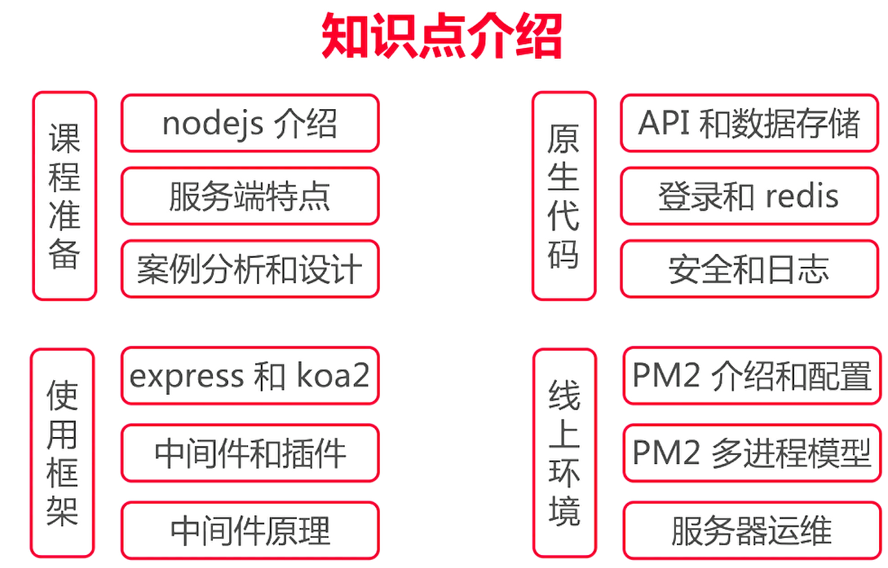
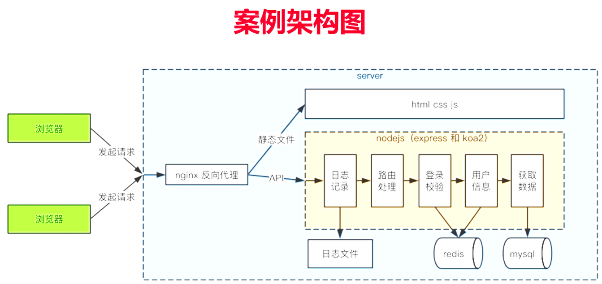

#  Node.js 从零开发web server博客项目

## 第1章 导读

### Nodejs 的真正用途

- Nodejs，一个 javascript 的运行环境
- **运行在服务器，作为 web server**
- 运行在本地，作为打包、构建工具

### 学习 Nodejs 的困惑

- Nodejs 运行在服务端，而非浏览器环境。
- 服务端开发的思路和套路，与前端完全不一样。

### 课程概述

- 做什么？——nodejs入门到实践，开发个人博客系统
- 哪些部分？——API，数据存储，登录，日志，安全
- 技术？——http stream session mysql redis nginx pm2

### 知识点介绍



### 案例架构图



### 课程安排

- 课程准备
- 使用框架开发案例
- 原生代码开发案例

**课程准备**

- nodejs 下载安装，nodejs 和 javascript 的区别
- 服务端的特点，服务端和前端的区别
- 博客项目的需求分析和技术方案设计

**使用原生代码开发案例项目**

- 实现 API和数据存储，使用 mysql 数据库
- 从 0 实现登录，并使用 redis 存储登录信息
- 安全，日志记录和日志分析

**使用框架开发案例项目**

- 分别使用 express 和 koa2
- 中间件机制
- 常用插件
- 中间件原理

**线上环境**

- PM2 介绍和配置
- **PM2 多进程模型**
- 关于服务器运维

**讲授方式**

- 直接通过案例来学习，更能学以致用
- 先用原生代码，再用框架和插件，先学原理再学应用
- 一个案例做三遍，更能通过对比了解框架的设计和价值

### 课程收获

- 学会使用 nodejs 开发服务端，成为一名后端开发人员
- 学会服务端的其他工具，mysql redis nginx 等
- 学会服务端开发的思想，和前端开发的区别

### 重点提示

- 只关注后端，不讲解前端
- 不会深入讲解 mysql redis 和 nginx，但能满足项目需求
- 不讲解 vue 和 React 的 SSR

## 第2章

- 下载 & 安装
- nodejs 和前端 javascript 的区别
- server 开发和前端开发的区别

### 下载和安装

- 普通方式
- 使用NVM

**普通方式**

- 访问官网 http://nodejs.cn/，下载并安装
- 打开命令行，运行 node -v 和 npm -v 测试

**使用NVM**

- nvm，nodejs 版本管理工具，可切换多个 nodejs 版本
- mac os，使用 brew install nvm
- windows，github 中搜索 nvm-windows，有下载地址

**总结**

- 如果需要同时使用多个node版本，推荐用nvm
- 无论用哪种方式，必须安装好 node，版本要 >= 8.0

### nodejs 和 javascript 的区别

- ECMAScript
- javascript

**ECMAScript**

- 定义了语法，写 js 和 nodejs 都必须遵守
- 变量定义、循环、判断、函数
- 原型和原型链、作用域和闭包、异步
- 不能操作 DOM，不能监听 click  事件，不能发送 ajax 请求
- 不能处理 http 请求，不能操作文件
- 即，只有 ECMAScript，几乎做不了任何实际的项目

**javascript**

- 使用 ECMAScript 语法规范，外加 Web API，缺一不可
- DOM 操作，BOM 操作，事件绑定，Ajax 等
- 两者结合，即可完成浏览器端的任何操作

**nodejs**

- 使用 ECMAScript 语法规范，外加 nodejs API，缺一不可
- 处理 http，处理文件等，具体参考 http://nodejs.cn/api/
- 两者结合，即可完成 server 端的任何操作

**总结**

- ECMAScript 是语法规范
- nodejs = ECMAScript + nodejs API

### 补充

- commonjs 模块化
- nodejs debugger

## 第3章 项目介绍

课程是通过案例的形式来学习 nodejs ，本章先来介绍这个案例，即个人博客项目。包括需求分析、原型图设计、以及 server 端的技术方案设计。有了详细的设计方案，才能指导后续的实际开发。

### 3-1 项目需求分析

- 目标
  - 开发一个博客系统，具有博客的基本功能
  - 只开发 server 端，不关心前端
- 需求
  - 首页，作者主页，博客详情页
  - 登录页
  - 管理中心，新建页，编辑页
- 技术方案

总结

- 需求一定要明确，需求指导开发
- 不要纠结于简单的页面样式，并不影响 server 端的复杂度

###  3-2 技术方案

- 数据如何存储
- 如何与前端对接，即接口设计

数据存储

- 博客
- 用户

存储博客

| id   | title | content | createtime    | author   |
| ---- | ----- | ------- | ------------- | -------- |
| 1    | 标题1 | 内容1   | 1567757639968 | zhangsan |
| 2    | 标题2 | 内容2   | 1567757665307 | lisi     |

存储用户

| id   | username | password | realname |
| ---- | -------- | -------- | -------- |
| 1    | zhangsan | 123      | 张三     |
| 2    | lisi     | 123      | 李四     |

接口设计

| 描述               | 接口             | 方法 | url参数                         | 备注                           |
| ------------------ | ---------------- | ---- | ------------------------------- | :----------------------------- |
| 获取博客列表       | /api/blog/list   | get  | author 作者，keyword 搜索关键字 | 参数为空的话，则不进行查询过滤 |
| 获取一篇博客的内容 | /api/blog/detail | get  | id                              |                                |
| 新增一篇博客       | /api/blog/new    | post |                                 | post 中有新增的信息            |
| 更新一篇博客       | /api/blog/update | post | id                              | postData 中有更新的内容        |
| 删除一篇博客       | /api/blog/del    | post | id                              |                                |
| 登录               | /api/user/login  | post |                                 | postData 中有用户名和密码      |

关于登录

- 业界有统一的解决方案，一般不用再重新设计
- 实现起来比较复杂，课程后面会讲解

总结

- 明白“存储”和“接口的概念和用途”

## 第4章 开发博客项目之接口

要开发一个博客项目的 server 端，首先要实现技术方案设计中的各个 API 。本章主要讲解如何使用原生 nodejs 处理的 http 请求，包括路由分析和数据返回，然后代码演示各个 API 的开发 。但是本章尚未连接数据库，因此 API 返回的都是假数据。

- nodejs 处理 http 接口
- 搭建开发环境
- 开发接口（暂不连接数据库，暂不考虑登录）

### 4-1 http-概述

- DNS 解析，建立 TCP 连接，发送 http 请求
- server 接收到 http 请求，处理，并返回
- 客户端接收到返回数据，处理数据（如渲染页面，执行 js ）

4-2 至 4-4 nodejs 处理 http请求

- get 请求和 querystring
- post 请求和 postdata
- 路由

简单示例
```js
const http = require('http')

const server = http.createServer((req, res) => {
	res.end('hello world')
})

server.listen(8000)
// 然后浏览器访问 http://localhost:8000/
```

### 4-2 处理get请求**试看**

- get 请求，即客户端要向 server 端获取数据，如查询博客列表
- 通过 querystring 来传递数据，如 a.html?a=100&b=200
- 浏览器直接访问，就发送 get 请求

新建 http-test/

`npm init -y`，初始化 npm

打开 package.json，设置入口文件为 app.js `"main": "app.js"`

新建 app.js

```js
const http = require('http')
const querystring = require('querystring')

const server = http.createServer((req, res) => {
  console.log('method: ', req.method)
  const url = req.url
  console.log('url: ', url)
  req.query = querystring.parse(url.split('?')[1])
  console.log('query: ', req.query)
  res.end(
    JSON.stringify(req.query)
  )
})
server.listen(8000)
console.log('server is running on 8000')
```

运行，`node app.js`

浏览器输入`http://localhost:8000/api/blog/list?author=zhangsan&keyword=A`

服务端控制台

```shell
method:  GET
url:  /
query:  [Object: null prototype] {}
method:  GET
url:  /api/blog/list?author=zhangsan&keyword=A
query:  [Object: null prototype] { author: 'zhangsan', keyword: 'A' }
```

页面显示

```js
{
  "author": "zhangsan",
  "keyword": "A"
}
```

### 4-3 处理post请求

- post 请求，即客户端向服务端传递数据，如新建博客
- 通过 post data 传递数据，后面会演示
- 浏览器无法直接模拟，需要手写 js，或者使用 postman

```js
const http = require('http')

const server = http.createServer((req, res) => {
  if (req.method === 'POST') {
    // req 数据格式
    console.log('req content-type', req.headers['content-type'])
    // 接收数据
    let postData = ''
    req.on('data', chunk => {
      postData += chunk.toString()
    })
    req.on('end', () => {
      console.log('postData: ', postData)
      res.end('hello world!')
    })
  }
})

server.listen(8000)
console.log('server is running on 8000')
```

重新运行，`node app.js`

postman`http://localhost:8000/`，选择 post，body，raw，JSON(application/json)

请求数据为

```json
{
	"name": "张三",
	"age": 25
}
```

服务端控制台

```shell
req content-type application/json
postData:  {
        "name": "张三",
        "age": 25
}
```

响应 body 显示

```js
hello world!
```

### nodejs 处理路由

路由是哪一部分

| url地址                         | 路由          |
| ------------------------------- | ------------- |
| https://github.com/             | /             |
| https://github.com/username     | /username     |
| https://github.com/username/xxx | /username/xxx |

处理路由

```js
const http = require('http')

const server = http.createServer((req, res) => {
  const url = req.url
  const path = url.split('?')[0]
  res.end(path) // 返回路由
})
server.listen(8000)
```

### 4-4 处理http请求的综合示例

### 4-5 搭建开发环境
### 4-6 初始化路由

开发接口

- 初始化路由：根据之前的技术方案的设计，做出路由
- 返回假数据：将路由和数据处理分离，以符合设计原则

接口设计之前的图

### 4-7 开发路由（博客列表路由）_1
### 4-8 开发路由（博客详情路由）
### 4-9 开发路由（处理 POSTData）
### 4-10 开发路由（新建和更新博客路由）
### 4-11 开发路由（删除博客路由和登录路由）
### 4-12 补充：路由和API