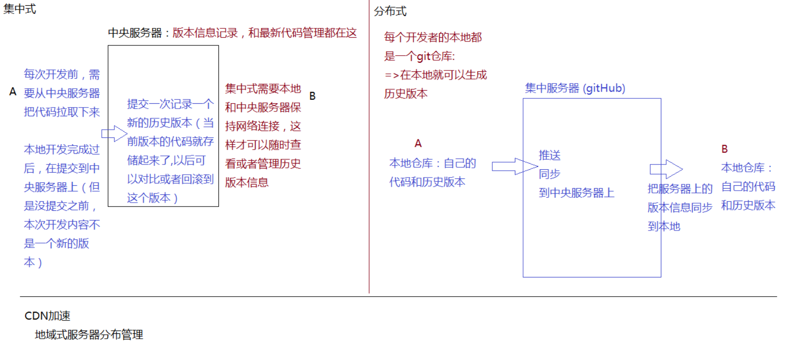

# github&git

## gitHub基础管理

https://github.com/

1.常规操作

- 登录/注册/邮箱验证
- 个人信息维护
- 仓库信息维护

2.coding 中文版 gitHub

https://coding.net/

https://github.com/

一个提供代码管理（托管）的公共平台，开发者会把自己生产的 组件/类库/插件/框架 等托管到这个平台中，供别人下载使用和研究。

在gitHub中，通过创建仓库管理项目，而gitHub支持开发者通过git操作，把本地的项目代码推送到指定的仓库中，它还提供了静态web页面的发布等。

在国内有一个和gitHub类似的网站：coding，也是提供代码管理的平台。


## git基础管理

1.基础信息速览

- git 发展史
- 什么是版本控制
- 集中式 VS 分布式

2.git安装

http://git-scm.com/

3.git工作流程

4.基础命令配置

```shell
git config -L
git config --global user.name 'xxx'
git config --global user.email 'xxx'
```

5.创建仓库

```shell
git init
```

.git文件存储当前git仓库的所有信息，不可以删除

 

git是一个分布式代码版本管理控制系统

- 记录当前产品代码的所有版本信息（历史修改信息），而且方便快速回退到某一个具体的版本。
- 方便团队协作开发，能够检测代码冲突，能够合并代码等

`svn`：在git诞生前就已经存在;de版本控制系统，不过它是“集中式”管理

