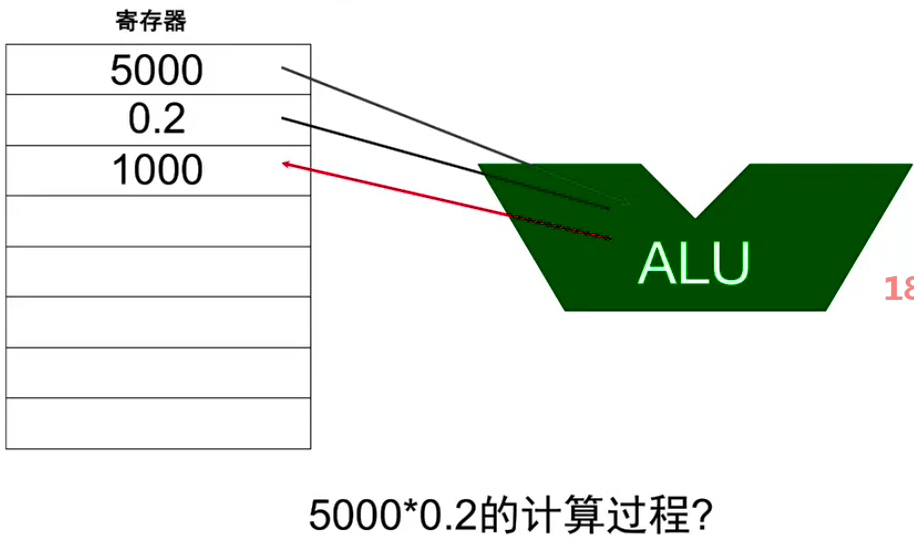
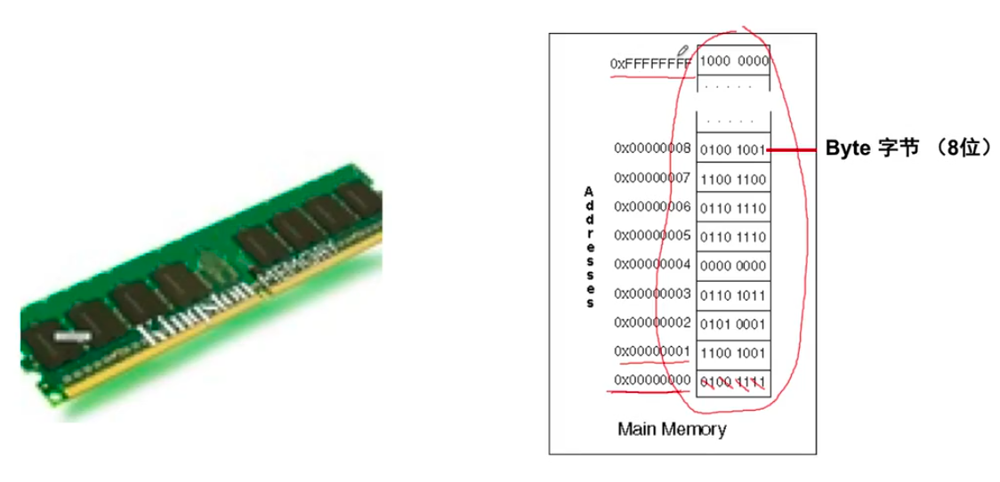
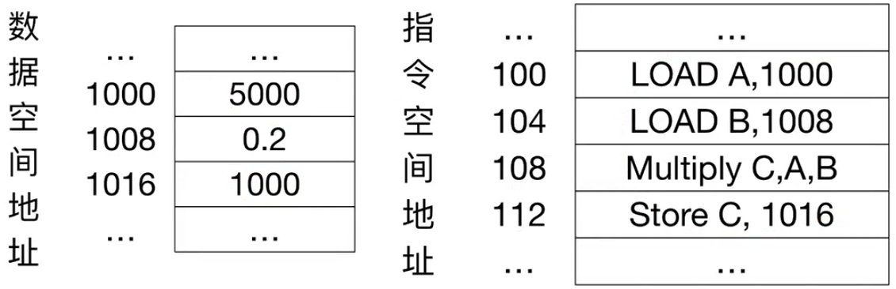
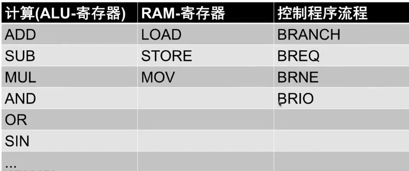
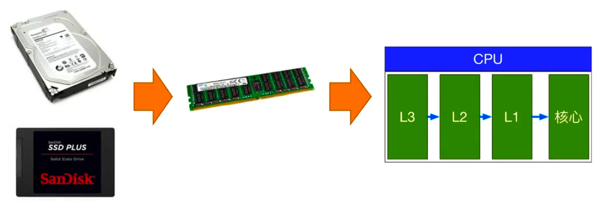
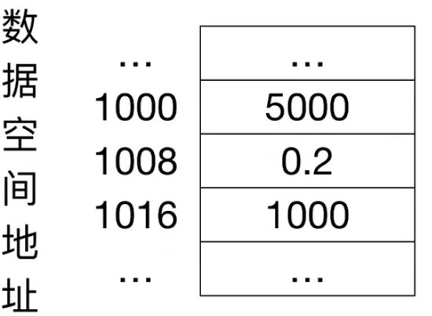

# 算法的基础知识

- 输入、输出和数量级
- 计算能力的改革
- CPU、寄存器和内存
- 二分查找
- 插入排序
- 冒泡排序

## 输入、输出和数量级

### 数量级

$$
1.5*10^3 = 1500
$$

数量级为3，千级，k(ilo-)

$$
2.6*10^6 = 1600000
$$

数量级为6，百万级，m(illion)

$$
1.3*10^9 = 1300000000
$$

数量级为9，十亿级，g(iga-)

**描述**

淘宝2017年双11订单量8.12亿 => 淘宝双11的订单数为**亿**级

知乎用户数突破1.6亿=>知乎的用户数为**亿**级

头条员工数突破1万=>头条的员工数为**万**级

**比较关系**

阿里市值4687亿美金，百度820亿美金 => 阿里市值领先百度1个数量级

北京人口总数2100万，长沙人口总数791万=>北京人口总数比长沙大1个数量级

**更多描述**

宇宙中有20万亿亿-40万亿亿课恒星 => 宇宙中恒星数量级为22

Apple市值10047亿美金 => 苹果市值到达T级

显示器的刷新频率通常为60HZ => 显示器的刷新间隔为10ms级， 1000/60=16.66666...

**总结**

- 具体的数字用来记录客观世界
- 模糊的数字用来理解客观世界

### 输入和输出

```js
function sum(A){
  return A.reduce((x,y)=>x+y, 0)
}
```

> 输入：数组
> 输出：数字
> 输入规模：A.length

算法是输入到输出的映射 

**输入规模**

统计淘宝2017年双11交易额 => 加和8.12亿订单 => 统计算法支持**十亿**级输入

**算法设计的客观条件**

- 淘宝统计订单的算法应该支持**十亿**级数据，在**毫秒**级时间内完成计算
- 知乎统计用户肖像的算法应该支持**亿**级数据，在**小时**时间内完成一次统计
- React的VirtualDOM应该支持**万**级数据，在**毫秒**级时间内完成一次计算

## 计算能力的改革

1946年，世界上第一台计算机ENIAC每秒执行5000次加法或者400次乘法。

1978年，8086芯片主频4.77-10MHz，拥有了浮点计算、三角函数等数学指令。每秒可以处理百万级指令。

2018年，骁龙845芯片拥有8核心，2.8GHz的主频；同时集成了GPU。

>  从ENIAC到骁龙CPU，人类的计算能力增长了至少**10万级**倍数

一个hadoop分布式集群动辄有数千台机器，**万**级CPU核心，利用分布式算法计算能力达到智能手机的**万**级倍数。

量子计算机，50量子比特的量子计算机每秒可以处理1125亿亿次计算。是大数据集群的**亿**级倍数。

## CPU、寄存器和内存

算法依赖的计算机模型？

ENIAC => 8086 => 大数据集群 => 量子计算机

### CPU+内存

短期记忆（很少事情）=> **寄存器（Reqister）**

推理计算 => **算数逻辑单元（ALU）**

长期记忆（很多事情）=> **随机存储器（RAM）**

其他：缓存等

### 寄存器（短期记忆）


### ALU（算数逻辑单元）

从一个寄存器取，计算完放入另一个寄存器。



### 随机存储器（长期记忆）

内存，访问每一个地址的时间相同



数据空间地址与指令空间地址



### 指令


### CPU指令集



用于计算的指令，特征是只涉及alu-寄存器之间的关系，像sin这种正弦计算一般是由硬件电路实现的，不消耗时间。MUL把两个寄存器中的数据放到另一个寄存器中。单个寄存器的数据加减。

ram-寄存器是操作内存的。LOAD 把内存的数据加载到寄存器中，STORE是再存回去，MOV把内存地址中的数据移到另一个内存地址。

控制程序流程，操作pc指针，相当于if else while等

这些指令构成了我们平常写的程序。我们写的程序最终会转化成指令(机器码)进行执行。

### 启动

开机的过程：数据从 硬盘=>内存=>cpu缓存=>cpu核心 进行alu计算



### 5000 * 0.2 = ?

5000*0.2的执行过程



## 二分查找

在字母顺序排列的试卷中，曹操/杜甫/黄飞鸿/刘备/李四/邱明/许褚/姚明/嬴政/张三，如何找到嬴政？

先找李四   =>   l<y    =>    邱明/许褚/姚明/嬴政/张三    =>   姚明    =>    y =y    =>    姚明/嬴政    =>    嬴政 

最坏情况规模为1000需要查找几次？

1000 500 250 125 62  31 15 7 3 1 => 10次 => 1000除几次2到1？=>
$$
2^9 = 512
$$

$$
2 ^ 10 =1024
$$

