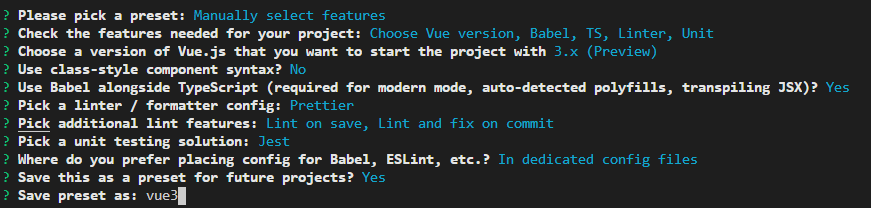

# vue3JosnSchemaForm

## 创建项目

- vue3项目结构
- vue项目基本开发知识
- vue3和vue2开发的区别

安装vue-cli，`npm i -g @vue/cli`

创建项目，`vue create vue3JsonSchemaForm`



进入项目，并启动，`yarn serve`

## 代码格式化

### 代码格式化工具prettier

 vscode安装扩展 Prettier - Code formatter

创建.prettierrc文件

```json
{
    "semi": false,
    "singleQuote": true,
    "arrowParens": "always",
    "trailingComma": "all"
}
```

vscode设置 setting 搜索 format，选择workspace（只针对此项目设置），将`Editor: Format On Save`打上勾。此时，项目中会都出一个.vscode的文件夹，里面有针对本项目的setting.json

### vsocde - auto save

vscode-settings搜索 save，选择`Files: Auto Save`设置为 onWindowChange，一旦我们切换窗口，vscode自动保存，并配合prettier格式化代码。

## 如何用ts在vue3中定义组件

### Component接口

defineComponent函数

如何定义Props的类型

