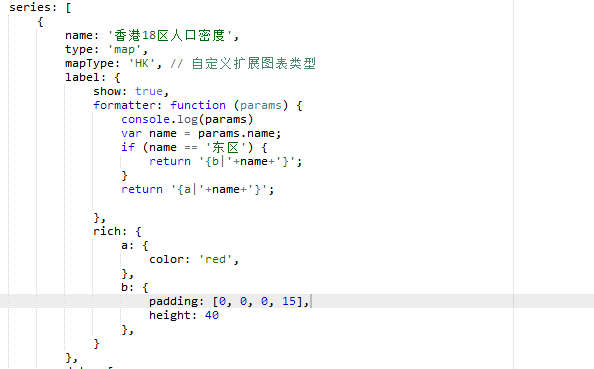

# charts

在vue中使用echarts  https://blog.csdn.net/qq_41467587/article/details/81107187 

vue中使用echarts来绘制世界地图和中国地图  https://www.cnblogs.com/ldlx-mars/p/9242250.html 

中国地图，省份名称重叠 https://github.com/apache/incubator-echarts/issues/4379 

​	

